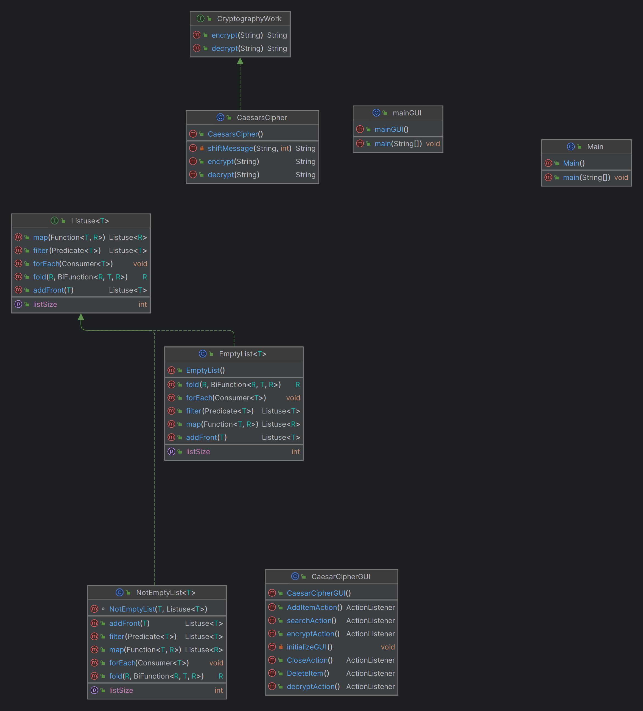

# Caesar's Cipher Encryptor

To use this program run [mainGUI](mainGUI.java). Then you can enter a series of messages.
Click on the "add" button to add your message to the list. If you would like to see what your
messages will be when Caesars Cipher encryption algorithm is applied to it, hit the "encrypt" button.
You can also revert it back to plain text by clicking "decrypt". If you would like to delete a message that is being
displayed, simply click on the message you would like to delete and then click the "delete" button.


## What is Caesar's Cipher?

Caesar's Cipher is a basic cryptographic algorithm that will essentially "hide" plain text.
It does this by shifting each letter in a message encrypted, 3 letters to the left.

Here is an example:

With Caesars Cipher Encryption applied "Hello" becomes "Ebiil".


```
TestingdddddddddddddddddTestingdddddddddddddddddTestingdddddddddddddddddTestingdddddddddddddddddTestingdddddddddddddddddTestingdddddddddddddddddTestingdddddddddddddddddTestingdddddddddddddddddTestingdddddddddddddddddTestingdddddddddddddddddTestingdddddddddddddddddTestingdddddddddddddddddTestingdddddddddddddddddTestingdddddddddddddddddTestingdddddddddddddddddTestingdddddddddddddddddTestingdddddddddddddddddTestingdddddddddddddddddTestingdddddddddddddddddTestingdddddddddddddddddTestingdddddddddddddddddTestingdddddddddddddddddTestingdddddddddddddddddTestingdddddddddddddddddTestingdddddddddddddddddTestingddddddddddddddddd
Testingddddddddddddddddd
Testingddddddddddddddddd
Testingddddddddddddddddd
Testingddddddddddddddddd
Testingddddddddddddddddd
TestingdddddddddddddddddTestingddddddddddddddddd
Testingddddddddddddddddd
Testingddddddddddddddddd
Testingddddddddddddddddd
Testingddddddddddddddddd
Testingddddddddddddddddd
Testingddddddddddddddddd
Testingddddddddddddddddd
Testingddddddddddddddddd
Testingddddddddddddddddd
Testingddddddddddddddddd
Testingddddddddddddddddd
Testingddddddddddddddddd
```


## Why care about this?

Cryptography serves as the backbone to a secure internet. Without cryptography, we would be subject to a wide range of
malicious attacks over the internet. Could even argue that the internet would not be usable without it. It safeguards our
data. There are many more cryptographic algorithms that beat Caesars Cipher out of the park and we can dive even deeper
into hash functions like with the algorithm SHA-256, it's quite an interesting field. 

### Future Vision

This program implements a very basic cryptographic algorithm. Something that really doesn't have
much use in the real world these days. That is why I made the linked list able to accept generic types and the
Cryptography interface. In the future the next step is to apply a more complex algorithm, such as Vigenère cipher and more.


## Project UML Diagram



## Acknowledgments

Inspiration, code snippets, etc.
* [Basics of Caesars Cipher](https://en.wikipedia.org/wiki/Caesar_cipher)
* [Coding Caesars Cipher](https://www.baeldung.com/java-caesar-cipher)
* [Basics of Cryptography](https://www.geeksforgeeks.org/cryptography-introduction/)
